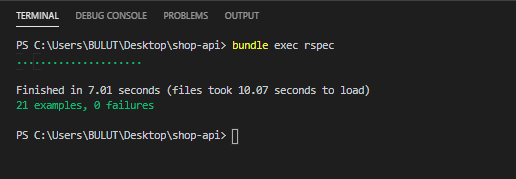

# E-Commerce Backend API

## Used Technologies

- Framework: Ruby on Rails (API mode)
- Database : SQLite3
- Test Freamwork : RSpec

## Versions

- Ruby Version : Ruby-2.6.6
- Rails Version : Rails 6.0.3.3
- RSpec Version : RSpec 3.9

# API Documentation

The API supports full CRUD functionality. Below are a few sample API calls.

### 1. Customers Request

```
# GET /customers
$ http :3000/customers
# POST /customers
$ http POST :3000/customers name='Yunus' surname='Bulut' email='bulutt1404ægmail.com' phone:'+905552170168'
# PUT /customers/:id
$ http PUT :3000/customers/1 name=Yunus
# DELETE /customers/:id
$ http DELETE :3000/customers/1
```

### Customers Insomnia Response


### 2. Products Request

```
# GET /customers/:customer_id/products
$ http :3000/customers/2/products
# POST /customers/:customer_id/products
$ http POST :3000/customers/2/products title='T-Shirt' price=35 quantity=100
# PUT /customers/:customer_id/products/:id
$ http PUT :3000/customers/2/products/1 done=true
# DELETE /customers/:customer_id/products/1
$ http DELETE :3000/customers/2/products/1
```

### 3. Orders Request

```
# GET /customers/:customer_id/orders
$ http :3000/customers/2/orders
# POST /customers/:customer_id/orders
$ http POST :3000/customers/2/orders order_no=34521445
# PUT /customers/:customer_id/orders/:id
$ http PUT :3000/customers/2/orders/1 done=true
# DELETE /customers/:customer_id/orders/1
$ http DELETE :3000/customers/2/orders/1
```

### 4. Carts Request

```
# GET /customers/:customer_id/carts
$ http :3000/customers/2/carts
# DELETE /customers/:customer_id/carts/1
$ http DELETE :3000/customers/2/carts/1
```

## RSpec with Unit Test and Integration Test


